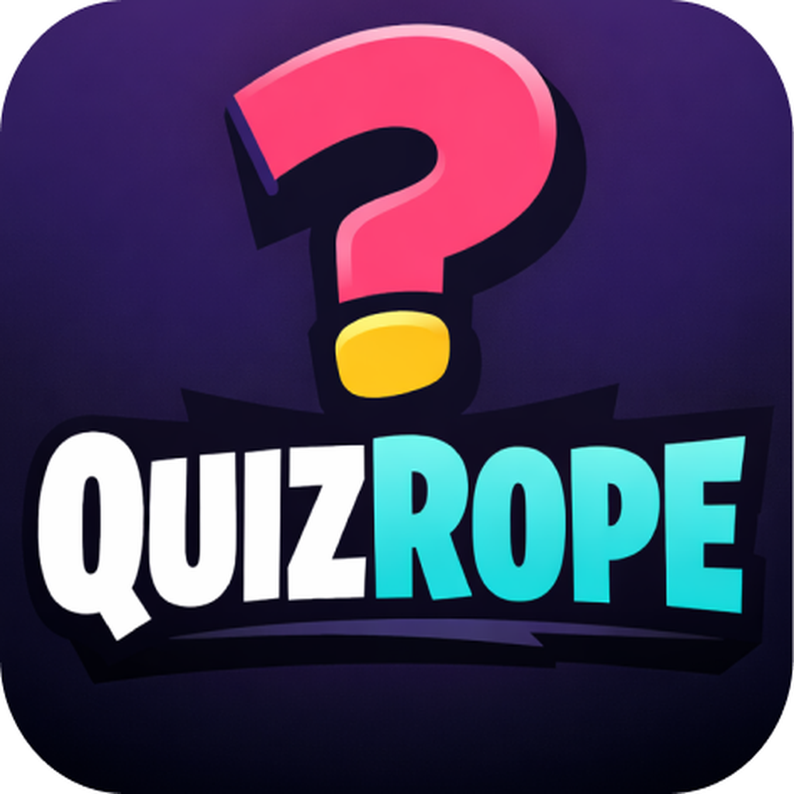

<div align="center">
  

  # QuizRope

  **An AI-powered educational quiz game for kids — built for tablets, played as a family.**

  
  
  
  
  
</div>

---

## What is QuizRope?

QuizRope is a tablet-first educational quiz application where children compete in a **tug-of-war mechanic**: each correct answer pulls the rope toward your side. The app supports three game modes, AI-generated questions tailored to each child's age and subject, a homework assistance feature powered by Google Gemini, and a full parent dashboard with per-child analytics.

---

## Features

### Game Modes
| Mode | Description |
|---|---|
| **Solo** | One child answers questions solo. A 15-second countdown per question. Full correction review at the end. |
| **Split Screen** | Two players on the same device. Portrait layout splits vertically — each player taps their half of the screen. Landscape orientation is locked during gameplay. |
| **Online Multiplayer** | Real-time match via WebSocket. Parent hosts; children join via a 6-character lobby code or QR scan. |

### Core Features
- **AI Question Generation** — Questions are generated per-match using Google Gemini via a LangGraph conversation graph. The graph uses MongoDB as a checkpoint store so Gemini remembers what was already generated and avoids repeats across rounds.
- **Homework Assist** — Parents photograph a homework page. Gemini analyzes it and returns a full markdown walkthrough with step-by-step explanations for each question. Includes a built-in AI chat tutor and an optional quiz generated from the homework content. Sessions can be tagged to a specific child.
- **Context Engineering for Chat** — The homework chat session uses a rolling summarization strategy: older messages are summarized into a dense context block, so Gemini's prompt never grows unbounded even over long conversations.
- **Child Profiles** — Parents manage multiple child profiles. Each child has a display name, age, grade, and avatar.
- **Per-Child Analytics** — Accuracy, total matches, correct answers, and a subject-by-subject performance breakdown. Stats aggregate both games where the child's ID was explicitly set and games played under their display name.
- **Leaderboard** — Cross-match ranking showing each child's total correct answers, accuracy, and games played.
- **Match Review** — After any game, parents can tap a match in a child's history to see every question, the child's answer, whether it was correct, and the explanation.
- **Subscription System** — Tiered access model (none / active / cancelled / expired / past_due) stored on the parent document.
- **Guest Play** — Children can join online matches from their own device as guests via a QR code or 6-character code, without needing an account.
- **Email Verification & Password Reset** — OTP-based email verification and password reset flow via Nodemailer.
- **Internationalization** — Full i18n support via `i18next` / `react-i18next`.
- **Haptics & Sound** — Per-event haptic feedback and a full set of game sounds (correct, wrong, tick, game start/end, rope pull, button press).

---

## Tech Stack

### Frontend
| Technology | Version | Role |
|---|---|---|
| Expo | SDK 54 | Build toolchain, native modules |
| React Native | 0.81.5 | Cross-platform UI |
| Expo Router | v6 | File-system based navigation |
| NativeWind | v4 | Tailwind CSS for React Native |
| React Native Reanimated | 4.1 | Animations |
| TanStack Query | v5 | Server state, caching, refetch |
| Zustand | v4 | Client-side game state |
| Socket.IO Client | v4 | Real-time multiplayer |
| Firebase (RNFirebase) | v23 | Authentication |
| Google Sign-In | v16 | OAuth |
| expo-screen-orientation | v9 | Landscape lock for splitscreen |
| expo-camera | v17 | QR scan + homework photo capture |
| expo-image-picker | v17 | Homework photo from gallery |
| react-native-markdown-display | v7 | Rendered homework answers |
| i18next + react-i18next | v25 / v16 | Translations |
| Bungee, Nunito (Google Fonts) | — | Typography |

### Backend
| Technology | Version | Role |
|---|---|---|
| NestJS | v10 | HTTP + WebSocket server |
| MongoDB + Mongoose | v8 | Primary database |
| LangChain + LangGraph | v1 | AI orchestration for question generation |
| `@langchain/google-genai` | v2 | Gemini API integration |
| LangGraph MongoDB Saver | v1 | Conversation checkpoint persistence |
| Firebase Admin SDK | v12 | Token verification |
| Socket.IO | v4 | Real-time events |
| Nodemailer | v8 | Email delivery (OTP, verification) |
| class-validator | v0.14 | Request body validation |

### Shared
A `shared/` workspace package (`@quizrope/shared`) contains TypeScript interfaces used by both frontend and backend:
- `user.types.ts` — `Parent`, `Child`, `DeviceSession`
- `match.types.ts` — `Match`, `MatchStatus`
- `analytics.types.ts` — `ChildPerformance`, `ChildMatchSummary`, `SubjectStats`, `AnswerDetail`
- `homework.types.ts` — `HomeworkSession`, `HomeworkChatMessage`
- `socket.events.ts` — typed socket event constants

---

## Architecture

```
quizrope/
├── backend/                  NestJS API server (port 3000)
│   └── src/
│       ├── auth/             Firebase auth guard, OTP, email verification
│       ├── children/         Child profiles, device sessions, guest links
│       ├── match/            Match CRUD, answer submission, analytics, leaderboard
│       ├── question/         LangGraph question generation (Gemini)
│       ├── homework/         AI homework analysis + chat tutor + summarization
│       ├── realtime/         Socket.IO gateway (online multiplayer)
│       └── subscription/     Subscription status management
│
├── frontend/                 Expo / React Native app
│   └── app/
│       ├── _layout.tsx       Root layout — route protection
│       ├── index.tsx         Landing / role selection
│       ├── home.tsx          Parent dashboard
│       ├── leaderboard.tsx
│       ├── auth/             Login, signup, email verify, password reset, guest join
│       ├── match/            Create, lobby, game, correction, review, history, detail
│       ├── child/            Child list, stats, match history, link-to-parent
│       └── homework/         Capture, processing, session viewer
│
└── shared/                   Shared TypeScript types (workspace package)
```

---

## Database Schema

### Parent
| Field | Type | Notes |
|---|---|---|
| `email` | String | Required |
| `displayName` | String | Required |
| `firebaseUid` | String | Firebase UID for auth |
| `children` | ObjectId[] | Refs to Child |
| `subscriptionStatus` | Enum | `none / active / cancelled / expired / past_due` |
| `subscriptionExpiresAt` | Date | |

### Child
| Field | Type | Notes |
|---|---|---|
| `displayName` | String | Required |
| `parentId` | ObjectId | Ref to Parent |
| `avatarUrl` | String | |
| `age` | Number | Default 8 |
| `grade` | String | Default "3rd" |

### Match
| Field | Type | Notes |
|---|---|---|
| `hostParentId` | ObjectId | Ref to Parent |
| `subject` | String | MATH / SCIENCE / ENGLISH / HISTORY / GEOGRAPHY |
| `difficulty` | String | EASY / MEDIUM / HARD |
| `gameMode` | Enum | `solo / splitscreen` |
| `teams` | TeamSubDoc[] | Name, color, side (LEFT/RIGHT), players |
| `questions` | ObjectId[] | Refs to Question |
| `status` | Enum | `WAITING / IN_PROGRESS / COMPLETED / CANCELLED` |
| `ropePosition` | Number | -5 to 5 |
| `maxRounds` | Number | Default 10 |
| `teamScoreLeft/Right` | Number | Points (+10 per correct answer) |
| `winner` | String | LEFT / RIGHT |
| `childIds` | ObjectId[] | Participating children |

### Answer
| Field | Type | Notes |
|---|---|---|
| `matchId` | ObjectId | Ref to Match |
| `questionId` | ObjectId | Ref to Question |
| `playerId` | String | Child's MongoDB ID or display name |
| `teamSide` | Enum | LEFT / RIGHT |
| `answerIndex` | Number | 0–3 |
| `isCorrect` | Boolean | |
| `responseTime` | Number | ms |
| `round` | Number | Question index within match |

### Question
| Field | Type | Notes |
|---|---|---|
| `text` | String | Question text |
| `options` | String[] | 4 answer choices |
| `correctIndex` | Number | 0–3 |
| `subject` | String | |
| `difficulty` | String | |
| `explanation` | String | Shown in review / correction |

### HomeworkSession
| Field | Type | Notes |
|---|---|---|
| `parentId` | ObjectId | Ref to Parent |
| `childId` | ObjectId? | Optional — ref to Child |
| `imageBase64` | String | Omitted from list responses |
| `title` | String | AI-extracted title |
| `subject` | String | AI-classified subject |
| `topics` | String[] | AI-extracted topic tags |
| `answersMarkdown` | String | Full step-by-step AI answer |
| `status` | Enum | `PROCESSING / READY / FAILED` |
| `linkedMatchIds` | ObjectId[] | Quizzes generated from this session |
| `quizTaken` | Boolean | |
| `chatSummary` | String | Rolling summary for context engineering |
| `summarizedMessageCount` | Number | How many messages have been summarized |

---

## AI Architecture

### Question Generation (LangGraph)
Each match triggers a `StateGraph` with a single `generateQuestions` node backed by Gemini Flash. The graph uses a **MongoDB checkpoint saver** keyed by `matchId` as the thread ID. This means:
- Gemini sees the full conversation history of prior question batches for the same match
- Follow-up rounds are aware of what was already generated, eliminating duplicates
- State is persisted in MongoDB and survives server restarts

### Homework Analysis (Gemini Vision)
The parent's photo is sent as a base64 image to Gemini. A structured prompt instructs the model to return a JSON object with `title`, `subject`, `topics`, and `answers_markdown`. The markdown includes step-by-step K-12-level explanations for every question on the page. Analysis runs async — the session starts in `PROCESSING` status and transitions to `READY` when complete.

### Homework Chat (Context Engineering)
The homework chat is a standard turn-based AI tutor. To prevent the prompt from growing unbounded:
1. The last 6 messages are always sent to Gemini raw (recent context)
2. When 10 or more messages have accumulated beyond the last summary, a summarization pass runs: Gemini condenses the older messages into a dense factual summary
3. The summary is stored in `chatSummary` on the session document and `summarizedMessageCount` is advanced
4. On every chat turn, the full context sent to Gemini is: `[chatSummary] + [last N unsummarized messages]`

---

## Game Flow

### Solo / Split Screen (Local)
```
Parent configures match → createMatch (API) → navigate to /match/game
  → Load questions from match.questions[]
  → 15s countdown per question (per player in splitscreen)
  → On answer: submitAnswer (API, best-effort) → rope animation
  → After maxRounds: advanceQuestion returns gameOver=true
  → completeMatch (API) → GameEndOverlay
  → Optional: navigate to /match/review/:childId
```

### Online Multiplayer (WebSocket)
```
Parent creates match → lobby (WS: match:join)
  → Children join via code/QR (WS: match:join)
  → Host starts → server sends game:question events
  → Each answer: WS game:answer → server broadcasts result
  → Server auto-advances on timeout or all players answered
  → game:end broadcast → GameEndOverlay
```

---

## Analytics

Child performance is computed entirely from the `Answer` collection — never from cached fields on Match or Child documents. This avoids stale data and makes the numbers accurate even for historical matches.

Key design decisions:
- **Global totals** are computed with a simple `$group` on answers directly — no `$lookup` so no rows can be dropped
- **Subject breakdown** uses a separate `$lookup + $unwind` pipeline with `preserveNullAndEmptyArrays: true` and filters out answers whose question no longer exists
- **Player ID matching** uses `{ $in: [childId, displayName] }` to catch games played both with the child chip selected (MongoDB ID as playerId) and games where the parent typed the display name

---

## Route Protection

`frontend/app/_layout.tsx` runs a segment-based guard on every navigation:

```ts
const PUBLIC_ROUTES = ["index", "auth"];
// segments[0] === "auth" → public (login, signup, etc.)
// segments[0] === "index" → public (landing)
// everything else → requires authentication
// exception: /auth/child-join is public but also accessible while authenticated
```

Unauthenticated access to a protected route → `replace("/")`.
Authenticated access to a public route → `replace("/home")`.

---

## Running Locally

### Prerequisites
- Node.js 20+
- Yarn 4 (Berry)
- MongoDB (local or Atlas URI)
- Expo custom dev client build (Expo Go is not supported — the app uses native modules)

### Environment Variables

**backend/.env**
```env
MONGODB_URI=mongodb://localhost:27017/quizrope
GEMINI_API_KEY=your_google_gemini_key
FIREBASE_SERVICE_ACCOUNT={"type":"service_account",...}
EMAIL_HOST=smtp.example.com
EMAIL_PORT=587
EMAIL_USER=noreply@example.com
EMAIL_PASS=your_email_password
```

### Install & Start

```bash
# Install all dependencies (backend + frontend)
yarn install:all

# Start backend (watch mode)
yarn backend:dev

# Start frontend (Expo dev server)
yarn frontend:dev
```

Or use the combined dev script:
```bash
yarn dev
```


### iOS / Android Build

```bash
cd frontend

# iPhone simulator
npm run ios:iphone

# iPad simulator
npm run ios:ipad

# Android
npm run android
```

---

## Frontend Source Structure

```
frontend/src/
├── components/
│   ├── common/         AnimatedLoader, BouncePress, Button, EmptyState,
│   │                   ScreenHeader, StaggeredList, Toast, AvatarIcon
│   ├── game/           SplitscreenLayout, SoloMultiplayerLayout,
│   │                   QuestionCard, AnimatedOption, GameEndOverlay,
│   │                   TugOfWarRope3D, ScorePop
│   └── homework/       HomeworkChatSheet, HomeworkQuizSheet,
│                       HomeworkBottomBar, MarkdownAnswer
├── config/
│   └── subjectThemes.ts   Per-subject color/label/badge config
├── constants/
│   ├── theme.ts           FONTS, FORTNITE_COLORS
│   └── sampleQuestions.ts Fallback questions for offline testing
├── context/               React contexts (auth, etc.)
├── hooks/
│   ├── useOrientation.ts  usePortrait, useLandscape, useGameOrientation
│   └── useHomeworkChat.ts Homework AI chat hook with streaming
├── services/
│   ├── api.ts             Typed API client (all HTTP calls)
│   ├── socket.ts          Socket.IO service
│   ├── sound.ts           expo-audio sound service
│   └── haptics.ts         expo-haptics service
└── stores/
    └── gameStore.ts       Zustand store: match state, scores, questions,
                           corrections, child session, locale
```

---

## Subjects & Difficulty

| Subject | Difficulties |
|---|---|
| MATH | EASY (ages 6–12) · MEDIUM (ages 13–17) · HARD (ages 18+) |
| SCIENCE | same |
| ENGLISH | same |
| HISTORY | same |
| GEOGRAPHY | same |

Difficulty maps to age-appropriate Gemini prompting parameters, ensuring questions are calibrated to the child's grade level.

---

## App Identifiers

| Platform | Value |
|---|---|
| iOS Bundle ID | `com.quizrope.app` |
| Android Package | `com.quizrope.app` |
| Deep link scheme | `quizrope://` |
| Expo slug | `quizrope` |


